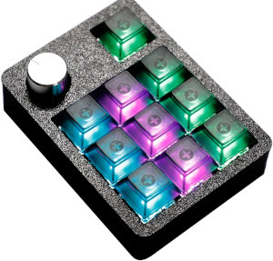
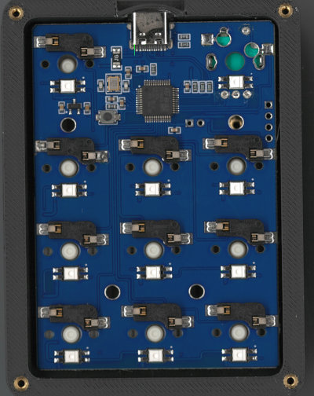
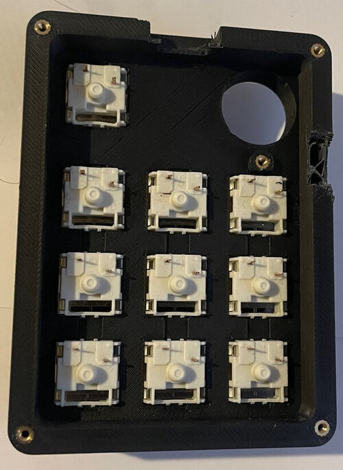
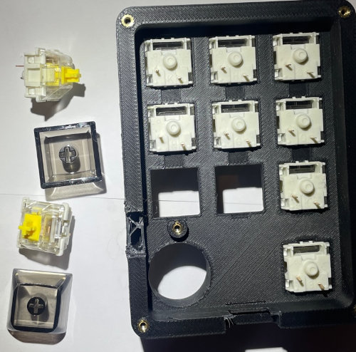
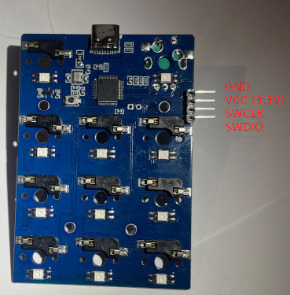
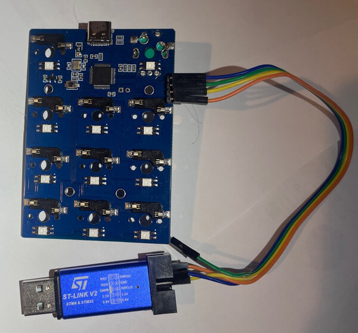

# QMK/VIAL Firmware for YMDK CV11 keypads

This projects documents the code and hardware of cheap (but great)
11 keys keypad, commonly called "CV11" on most retail websites.
It has 10 keys + 1 Rotary Encoder (Left/Right/Push), and 11 RGB LEDs.

[YMDK CV11 Page](https://ymdkey.com/products/cv11-11-key-mini-mechanical-keyboard-wired-hot-swap-rgb-knob-pla-3d-printed-case-supports-vial-macro-for-gaming-office?)



Common search terms are "YMDK CV11 11-Key Keypad"

## Overview

### Hardware

* 10 hot-swappable keys + 10 transparent keycaps
* 1 Rotary Encoder
* 11 RGB LEDs (ws2812)
* USB-C connector
* Microcontroller: STM32F103CBT6 (128KB flash, 20KB RAM, likely a knock-off)
* 3D-printed case, great quality but functional.

### Photos



(ignore the notch in the 3D-printed case, it was needed for debugging)



On the retail website these yellow keys were advertised as "Gateron SMD Yellow Switches":



Also: [high-resolution photo of the PCB](photos/pcb_hi_res.jpg) - if you need to squint and trace some lines...

### Original Software

The device comes with what is likely a proprietary variant of `vial-qmk`
firmware, with a custom bootloader (modified DAP-BootLoader).
The "Vial" application works with it as-is.

`dmesg` shows:

```
usb 3-4.4.2: new full-speed USB device number 63 using xhci_hcd
usb 3-4.4.2: New USB device found, idVendor=45d4, idProduct=1101, bcdDevice= 0.02
usb 3-4.4.2: New USB device strings: Mfr=1, Product=2, SerialNumber=3
usb 3-4.4.2: Product: CV11
usb 3-4.4.2: Manufacturer: MTKB
usb 3-4.4.2: SerialNumber: vial:f64c2b3c
input: MTKB CV11 as /devices/pci0000:00/0000:00:1c.4/0000:03:00.0/usb3/3-4/3-4.4/3-4.4.2/3-4.4.2:1.0/0003:45D4:1101.040E/input/input891
hid-generic 0003:45D4:1101.040E: input,hidraw4: USB HID v1.11 Keyboard [MTKB CV11] on usb-0000:03:00.0-4.4.2/input0
hid-generic 0003:45D4:1101.040F: hiddev2,hidraw5: USB HID v1.11 Device [MTKB CV11] on usb-0000:03:00.0-4.4.2/input1
input: MTKB CV11 Mouse as /devices/pci0000:00/0000:00:1c.4/0000:03:00.0/usb3/3-4/3-4.4/3-4.4.2/3-4.4.2:1.2/0003:45D4:1101.0410/input/input892
input: MTKB CV11 System Control as /devices/pci0000:00/0000:00:1c.4/0000:03:00.0/usb3/3-4/3-4.4/3-4.4.2/3-4.4.2:1.2/0003:45D4:1101.0410/input/input893
input: MTKB CV11 Consumer Control as /devices/pci0000:00/0000:00:1c.4/0000:03:00.0/usb3/3-4/3-4.4/3-4.4.2/3-4.4.2:1.2/0003:45D4:1101.0410/input/input894
input: MTKB CV11 Keyboard as /devices/pci0000:00/0000:00:1c.4/0000:03:00.0/usb3/3-4/3-4.4/3-4.4.2/3-4.4.2:1.2/0003:45D4:1101.0410/input/input895
hid-generic 0003:45D4:1101.0410: input,hidraw6: USB HID v1.11 Mouse [MTKB CV11] on usb-0000:03:00.0-4.4.2/input2
```


To get into DFU/Bootloader mode, press and hold the rotaty encoder button, then
plug in the USB cord.

`dmesg` then shows:

```
usb 3-4.4.2: New USB device found, idVendor=1209, idProduct=db42, bcdDevice= 1.10
usb 3-4.4.2: New USB device strings: Mfr=1, Product=2, SerialNumber=3
usb 3-4.4.2: Product: DAPBoot DFU Bootloader
usb 3-4.4.2: Manufacturer: Devanarchy
usb 3-4.4.2: SerialNumber: 461014877089515254FF6F06
usb-storage 3-4.4.2:1.1: USB Mass Storage device detected
scsi host11: usb-storage 3-4.4.2:1.1
scsi 11:0:0:0: Direct-Access     Example  UF2 Bootloader   42.0 PQ: 0 ANSI: 4
sd 11:0:0:0: Attached scsi generic sg10 type 0
sd 11:0:0:0: [sdk] 8000 512-byte logical blocks: (4.10 MB/3.91 MiB)
sd 11:0:0:0: [sdk] Write Protect is off
sd 11:0:0:0: [sdk] Mode Sense: 03 00 00 55
sd 11:0:0:0: [sdk] Incomplete mode parameter data
sd 11:0:0:0: [sdk] Assuming drive cache: write through
 sdk:
sd 11:0:0:0: [sdk] Attached SCSI removable disk
```


```
# dfu-util -l
Found DFU: [1209:db42] ver=0110, devnum=64, cfg=1, intf=0, path="5-1", alt=0,
           name="DAPBoot DFU", serial="461014877089515254FF6F06"
```

In DFU/Bootloader mode the device acts as a mass-storage device (UF2-style),
with the following files:

```
# catINFO_UF2.TXT
UF2 Bootloader v2.1.1-dirty
Model: MT KB
Board-ID: STM32F103-blue-pill-v0

# ls -l CURRENT.UF2
-rwxr-xr-x 1 root root 262144 Dec 31  1979 CURRENT.UF2

# file CURRENT.UF2
CURRENT.UF2: UF2 firmware image, file size 00000000, base address 0x8000000, 512 total blocks
```

## QMK/Vial firmware Overview

> **IMPORTANT NOTE**: it is absolutely possible to brick your keyboard!
>
> Reason: the bootloader is customized, and it is only software-activated (there is no
> "BOOT" physical button, only a RST physical button).
> If you flash a firmware that messes up the boot sequence, or doesn't set
> the bootloader code correctly, you will **not** be able to enter DFU/bootloader
> mode again.
>
> **DO NOT** trust sources that claim "you can always go back to the bootloader and re-flash
> your device".
>
> There is a way around it, but it requires soldering and using ST-Link-V2 to reprogram
> the STM32 chip - and most people don't have the needed hardware. So while technically the
> device isn't completely 'bricked' - it still can't be recovered without additional work
> (see [troubleshooting](troubleshooting.md) for details).


### Pinout

These are the STM32F103 pins that are relevant for QMK:

| Pin | Function | Details |
| :--- | :--- | :--- |
| **A1** | Key 1 | Top Right Key |
| **A4** | Key 4 | Top-right button |
| **A5** | Key 7 | Middle-right button |
| **A6** | Key 10 | Bottom-right button |
| **A7** | Key 9 | Bottom-middle button |
| **B0** | Key 8 | Bottom-left button |
| **B1** | Key 3 | Top-middle button |
| **B2** | Key 6 | Middle-middle button |
| **B9** | RGB Led | WS2812 Data |
| **B10** | Key 5 | Middle-left button |
| **B11** | Key 2 | Top-left button |
| **B13** | Key 0 | Rotary Encoder Button |
| **B14** | Encoder A | Rotary Rotation A |
| **B15** | Encoder B | Rotary Rotation B |

Additional PINs that are less relevant here:

| Pin | Function | Details |
| :--- | :--- | :--- |
| **A9** | NC | Likely RX1 |
| **A10** | NC | Likely TX1 |
| **A11** | USB- |  |
| **A12** | USB+ |  |
| **A13** | SWD-IO | Serial Wire Debug Data |
| **A14** | SWD-CLK | Serial Wire Debug Clock |

### STM32 Clone Flash Size

The `STM32F103CTB6` on the PCB is likely a clone (or, maybe my analysis is incorrect?).
One implication is that the flash-size register at 0x1FFFF7E0 reports 64KB
instead of the actual 128KB physical flash.

In QMK/VIAL, EEPROM is emulated in FLASH for STM32 (that is, whenever
QMK documentation/code mention "writing EEPROM", it is actually writing to flash).

In pure QMK, it seems to "just work" (likely because the code uses the predfined configuration values).
In vial-qmk, the EEPROM flash location is calculated based on the register value, and it overwrites the
application code.
The solution is to `#define WEAR_LEVELING_EFL_FLASH_SIZE` in `config.h`. DO NOT REMOVE THIS defintion.

It also requires custom configuration for `openocd` if you resort to desperate debugging means
(see [troubleshooting](troubleshooting.md) for details).

### Bootloader

The bootloader (based on the UF2 signature) is a modified `UF2 Bootloader v2.1.1-dirty`
(likely [devanlai/dapboot](https://github.com/devanlai/dapboot)). Since it is clearly modified,
there's no way to easily know what the modifications are.

The bootloader sits at the first 16KB of the Flash. To accomodate that, `rules.mk` refers to a
linker script file `ld/STM32F103xB_dapboot.ld`.

### Activating DFU/Bootloader/UF2 mode

To the best of my understanding:
1. The microcontroller loads the bootloader
2. The bootloader checks for valid app signature in the flash
3. If the flash (app region) is erased or invalid, boots into DFU mode
4. If the flash (app region) is valid, it then checks for a MAGIC value
  in a specific memory address (`0x20004000`).
5. If it contains the value `BOOT` (`0x544F4F42`) - it boots into DFU.
6. If it contains ANY other value, it jumps to the application code.

In a normally functioning firmware application code, when the user wants to go into DFU
mode (e.g. pressing and holding the Rotary Encoder button, connected to PIN B13):

1. bootloader checks for valid app signature in flash (it is found).
2. bootloader checks for MAGIC value (NOT found - because the microcontroller was just turned
   on and the memory is all zeros)
3. bootloader jumps to application code
4. application code (during early boot stage) detects B13 being pressed
5. application code sets MAGIC value in memory address (`0x20004000 => 0x544F4F42`)
6. application code then RESETs the microcontroller (but NOT reseting the RAM)
7. bootloader repeats the sequence, but now finds MAGIC value
8. bootloader goes into DFU mode.

Hence, if you flash a buggy application code, that messes up the early boot check,
you can be locked out of DFU mode - the bootloader will jump to the application,
and the application will never be able to trigger DFU mode again.

Luckily, QMK and VIAL-QMK contains exactly the needed code for that (called the `bootmagic` feature).
Also required: the function `bootloader_jump` in `cv11.c` sets the magic `BOOT` value to the correct memory address.
DO NOT disable the `bootmagic` feature and do not remove this code from `cv11.c`.

By default the `bootmagic` feature uses the FIRST defined key, which happens to be B13 (rotary encoder button).
This is defined in `keyboard.json`. To change it, read [QMK BootMagic docs](https://docs.qmk.fm/features/bootmagic).


### Keys

The keys are connected directly to the GPIOs of the microcontroller (i.e. no rows/columns scans needed).
In `keyboard.json`:
```
  "matrix_pins": {
        "direct": [
            ["B13", "A1", "B11", "B1", "A4", "B10", "B2", "A5", "B0", "A7", "A6"]
        ]
    },

```

This means that the logical matrix (used in `keymap.c`, in `vial.json` and elsewhere)
is considered to be 1x11, regardless of how the keys are physically arranged on the PCB.
That is, in the code, `MATRIX_ROWS=1` and `MATRIX_COLS=11` .

`keymap.c` contains the following:
```
const uint16_t PROGMEM keymaps[][MATRIX_ROWS][MATRIX_COLS] = {
    [0] = LAYOUT(
        KC_MUTE,           // Rotary Encoder Button
        KC_ESC,            // Top-Right Key (right of encoder)

        // 3x3 Grid
        KC_1, KC_2,  KC_3,  // Top Row: 1, 2, 3
        KC_4, KC_5,  KC_6,  // Middle Row: 4, 5, 6
        KC_7, KC_8,  KC_9   // Bottom Row: 7, 8, 9
    )
};
```


### WS2318 Driver: PWM+DMA

The 11 LEDs are connected to PIN B9, and is driver using PWM and DMA.

This is needed in `config.h`:
```
// WS2812 PWM driver via TIM4_CH4 (PB9) + DMA1_CH7 (TIM4_UP)
#define WS2812_PWM_DRIVER       PWMD4
#define WS2812_PWM_CHANNEL      4
#define WS2812_PWM_DMA_STREAM   STM32_DMA1_STREAM7
#define WS2812_PWM_DMA_CHANNEL  7
```

in `mcuconf.h`:
```
#undef  STM32_PWM_USE_TIM4
#define STM32_PWM_USE_TIM4 TRUE
```

in `halconf.h`:
```
#define HAL_USE_PWM TRUE
#define HAL_USE_PAL TRUE
```

and in `keyboard.json`:
```
 "ws2812": {
        "pin": "B9",
        "driver": "pwm"
 },
```

The order of the LEDs is the same as the order of the keys as listed in the previous section
(i.e. the LED at the rotary encoder is first in the chain).


## Using pre-built firmware

> **DO THIS AT YOUR OWN RISK, THIS PROJECT COMES WITH ABSOLUTELY NO REPSONSIBILITY FOR BRICKING YOUR KEYPAD**


## Building QMK/VIA firmware for CV11

(This assumes the CV11 code has not yet been merged into the main QMK repository)

1. Install `qmk` as described in [https://docs.qmk.fm/newbs_getting_started](https://docs.qmk.fm/newbs_getting_started)
2. Make sure you have the `qmk_firmware` directory.
3. Copy the [`src/qmk_firmware/keyboards/cv11`](src/qmk_firmware_keyboards/cv11)
   directory from this project into your `qmk_firmware/keyboards` directory.
4. run:
    ```
    qmk compile -kb cv11 -km default
    ```
   To build the `cv11_default.uf2` file (will be stored in `qmk_firmware/cv11_default.uf2`).
5. Boot the CV11 keypad into DFU/bootloader mode (by pressing and holding the rotary encoder button
   when plugging in the USB cord)
6. If using Windows/Mac - a new USB drive will appear (likely called `MT.KEY`).
7. If using Linux (without GUI) - check `dmesg` for which device appeared. Note that it will be a drive
   without a partition (i.e. `/dev/sdg` not `/dev/sdg1`).
8. Copy the new `cv11_default.uf2` file to the USB drive, and by sure to **SAFELY DISCONNECT** using
   your operating system's method of "safely disconnect USB device".
   (Simiarly on linux, it is critical to do `sync` and clean `umount` - though it's possible that the
   USB device will disconnect and reboot once `sync` is complete, before doing `umount` - that's still OK).
9. Enjoy!
10. A MIDI variant: run `qmk compile -kb cv11 -km midi` to get `cv11_midi.uf2` - a keypad whose default configuration
   is ALL MIDI keys (great for QLAB, which is the original goal of this project).
   If this means nothing to you - just ignore MIDI all together.


Quick walkthrough on Linux:

```
# Install QMK
curl -fsSL https://install.qmk.fm | sh

# Setup QMK (downlaod everything and create ~/qmk_firmware):
# (see https://docs.qmk.fm/newbs_getting_started#set-up-qmk )
qmk setup

# Get this project
( cd $HOME ; git clone http://github.com/agordon/qmk-vial-ymdk-cv11 )

# Copy CV11 into qmk_firmware
cp -r ~/qmk-vial-cv11/src/qmk_firmware/keyboards/cv11 ~/qmk_firmware/keyboards

# Build CV11
qmk compile -kb cv11 -km default

# See the result:
$ file cv11_default.uf2
cv11_default.uf2: UF2 firmware image, family ST STM32F103, address 0x8004000, 156 total blocks

# Assuming the Keypad is already in DFU/Bootloader mode, find the drive
# ( /dev/sdk in the example below - yours will differ 0
$ lsblk -o NAME,TRAN,VENDOR,MODEL,SERIAL | grep UF2
sdk     usb    Example  UF2 Bootloader        461014877089515254FF6F06

# Mount it
mkdir /tmp/qmk_uf2
sudo mount /dev/sdk /tmp/qmk_uf2/

$ ls -l /tmp/qmk_uf2/
total 257
-rwxr-xr-x 1 root root 262144 Dec 31  1979 CURRENT.UF2
-rwxr-xr-x 1 root root    109 Dec 31  1979 INDEX.HTM
-rwxr-xr-x 1 root root     78 Dec 31  1979 INFO_UF2.TXT


## !!! SAVE THE ORIGINAL FIRMWARE !!!
cp -r /tmp/qmk_uf2 ~/cv11-original-firmware

# Overwrite with new firmware
sudo cp cv11_default.uf2 /tmp/qmk_uf2/
sync

# At this point the CV11 likely rebooted itself and disappeard from USB/DMESG,
# but it's still good practice to umount:
sudo umount /dev/sdk

# You will likely need to re-plug to USB to boot the CV11 keypad into the new firmware.
```


## Building VIAL firmware for CV11

(This assumes the CV11 code has not yet been merged into the QMK-VIAL repository)

1. Install `qmk` as described in [https://docs.qmk.fm/newbs_getting_started](https://docs.qmk.fm/newbs_getting_started)
2. Make sure you have the `qmk_firmware` directory.
3. Then ALSO clone the `vial-qmk` repository (see the bottom of this page: [https://get.vial.today/manual/first-use.html](https://get.vial.today/manual/first-use.html)).
3. Copy the [`src/vial-qmk/keyboards/cv11/'](src/vial-qmk/keyboards/cv11/)
   directory from this project into your `vial-qmk/keyboards` directory.
4. run:
    ```
    qmk compile -kb cv11 -km vial
    ```
   To build the `cv11_vial.uf2` file (will be stored in `vial-qmk/cv11_vial.uf2`).
5. Boot the CV11 keypad into DFU/bootloader mode (by pressing and holding the rotary encoder button
   when plugging in the USB cord)
6. If using Windows/Mac - a new USB drive will appear (likely called `MT.KEY`).
7. If using Linux (without GUI) - check `dmesg` for which device appeared. Note that it will be a drive
   without a partition (i.e. `/dev/sdg` not `/dev/sdg1`).
8. Copy the new `cv11_default.uf2` file to the USB drive, and by sure to **SAFELY DISCONNECT** using
   your operating system's method of "safely disconnect USB device".
   (Simiarly on linux, it is critical to do `sync` and clean `umount` - though it's possible that the
   USB device will disconnect and reboot once `sync` is complete, before doing `umount` - that's still OK).
9. Enjoy!
10. A MIDI variant: run `qmk compile -kb cv11 -km vial_midi` to get `cv11_vial_midi.uf2` - a keypad whose 
   default configuration is ALL MIDI keys (great for QLAB, which is the
   original goal of this project).
   If this means nothing to you - just ignore MIDI all together.

```
# Install QMK
curl -fsSL https://install.qmk.fm | sh

# Setup QMK (download everything and create ~/qmk_firmware):
# (see https://docs.qmk.fm/newbs_getting_started#set-up-qmk )
qmk setup

# Now ALSO download vial-qmk
cd $HOME
git clone https://github.com/vial-kb/vial-qmk

# and setup "qmk" to use "vial-qmk" directory
cd ~/vial-qmk
qmk setup --home .

# verify - it should say HOME is "vial-qmk" not "qmk_firmware":
qmk env

# Get this project
( cd $HOME ; git clone http://github.com/agordon/qmk-vial-cv11 )

# Copy CV11 into vial-qmk
cp -r ~/qmk-vial-cv11/src/vial-qmk/keyboards/cv11 ~/vial-qmk/keyboards

# Build CV11
qmk compile -kb cv11 -km vial

# See the result:
$ file cv11_vial.uf2
cv11_vial.uf2: UF2 firmware image, family ST STM32F103, address 0x8004000, 156 total blocks

# Assuming the Keypad is already in DFU/Bootloader mode, find the drive
# ( /dev/sdk in the example below - yours will differ 0
$ lsblk -o NAME,TRAN,VENDOR,MODEL,SERIAL | grep UF2
sdk     usb    Example  UF2 Bootloader        461014877089515254FF6F06

# Mount it
mkdir /tmp/qmk_uf2
sudo mount /dev/sdk /tmp/qmk_uf2/

$ ls -l /tmp/qmk_uf2/
total 257
-rwxr-xr-x 1 root root 262144 Dec 31  1979 CURRENT.UF2
-rwxr-xr-x 1 root root    109 Dec 31  1979 INDEX.HTM
-rwxr-xr-x 1 root root     78 Dec 31  1979 INFO_UF2.TXT


## !!! SAVE THE ORIGINAL FIRMWARE !!!
cp -r /tmp/qmk_uf2 ~/cv11-original-firmware

# Overwrite with new firmware
sudo cp cv11_vial.uf2 /tmp/qmk_uf2/
sync

# At this point the CV11 likely rebooted itself and disappeard from USB/DMESG,
# but it's still good practice to umount:
sudo umount /dev/sdk

# You will likely need to re-plug to USB to boot the CV11 keypad into the new firmware.
```


## Troubleshooting

> **This is for advanced users**. It assumes some soldering capabilities,
> and having suitable ST-Link V2 hardware.

* The microcontroller (STM32F103) has very good debugging features, and is hard to totally "brick",
  *if* you have the right hardware.
* The most common hardware is the [Official ST-Link-V2 programmer](https://www.st.com/en/development-tools/st-link-v2.html) .
* Many good cheap clones of ST-Link-V2 prorgrammers are [readily available](https://www.google.com/search?q=st+link+v2+clone).

The CV11 PCB contains unpopulated headers holes for the ST-Link programmer. The top one (square) is GND. Below it, in order; VCC (3.3v), SWCLK , SWDIO. Soldering the header is easy. I recommend soldering it on the BOTTOM of the PCB, so that the PCB can be inserted back into the case. If you use right-angle dupont headers, like in the photo below, you could also close the back of the case while keeping the pins functional:



Then connect an ST-Link-V2 progammer:



**IMPORTANT**: If you connect both USB and ST-Link-V2 (which I recommend) - leave the ST-Link-V2 **VCC pin unconnected** (note the green wire in the picture above is **not** actually connected - only GND, SWCLK, SWDIO are connected).

Then install "openocd" the [Open On-Chip Debugger](https://openocd.org/) (there are other programs that work with ST-Link-V2, I happen to use openocd).


### Note about STM32F103 Flash Size

Because the STM32F103 is likely a clone, it reports 64KB of FLASH instead of the actual 128KB (see note about "clone" above).
`OpenOCD` respects this reported size (64KB) and this will lead to memory issues sooner or later. That is: if you just run simple commands (e.g. 'init; reset run ; exit;') the size doesn't matter it it will 'just work'.
It will also likely 'just work' if you flash firmware that's smaller than 64KB.
But once you cross the 64KB boundary, OpenOCD will report memory-related errors.
To solve this, we need to expliclt set FLASH_SIZE in the `openocd` command.

Example of such errors as reported by `openocd`:
```
Warn : no flash bank found for address 0x08010000
auto erase enabled
wrote 65536 bytes from file original_fw.bin in 1.873725s (34.157 KiB/s)

Error: checksum mismatch - attempting binary compare
diff 0 address 0x08010000. Was 0xff instead of 0x80
```

Techincally: Most sources recommend running openocd like so:

```
openocd -f interface/stlink.cfg -f target/stm32f1x.cfg -c 'COMMAND;COMMAND;'
```

I recommend using this (note the `set` must appear BEFORE `-f stm32f1x`):
```
openocd -c 'set FLASH_SIZE=0x20000' -f interface/stlink.cfg -f target/stm32f1x.cfg -c 'COMMAND;COMMAND;'
```

Make your life easier with an alias (which we'll use below):
```
alias openocd_cv11="openocd -c 'set FLASH_SIZE=0x20000' -f interface/stlink.cfg -f target/stm32f1x.cfg"
```

`udev` rule if ST-Link needs non-root access:

```
echo 'SUBSYSTEM=="usb", ATTR{idVendor}=="0483", ATTR{idProduct}=="3748", MODE="0666"' | \
  sudo tee /etc/udev/rules.d/70-stlink.rules
sudo udevadm control --reload-rules && sudo udevadm trigger
```


### Reading Flash Directly

With `openocd` connected, you can read the flash directly to a file:

```
openocd_cv11 -c 'init; halt ; dump_image fw_dump.bin 0x08000000 0x20000; shutdown"
```

The first 16KB will be the bootloader code, following by the application code.

To just read the bootloader:
```
openocd_cv11 -c "init; halt; dump_image flash_first16k.bin 0x08000000 0x4000; shutdown"
```

### Writing the original firmware

Assuming you saved the original firmware (CURRENT.UF2 , file size 256KB,
which I **highly recommend** to do), you can flash it back, regardless of DFU/bootloader
working or not (and in fact, regardless of the microcontroller running or not):

```
# Get the conversion UF2 conversion script:
mkdir -p ~/bin
wget https://raw.githubusercontent.com/microsoft/uf2/master/utils/uf2conv.py -O ~/bin/uf2conv.py
wget https://raw.githubusercontent.com/microsoft/uf2/master/utils/uf2families.json -O ~/bin/uf2families.json


# Then extract the binary firmware file from the UF2 file:
python3 ~/bin/uf2conv.py --convert --output original_fw.bin CURRENT.uf2

# and now flash the original firmware (and bootloader),
# then reboot the device
openocd_cv11 \
     -c "init; halt" \
     -c "stm32f1x mass_erase 0" \
     -c "flash write_image erase original_fw.bin 0x08000000" \
     -c "verify_image original_fw.bin 0x08000000" \
     -c "reset run; shutdown"
```

### Writing QMK/VIAL firmware directly

Once `openocd` is working, using it to update firmware is MUCH faster
than rebooting into DFU/Bootloader every time (and, it can be easily automated, too).

To do that, edit `rules.mk` and **COMMENT OUT** the following settings:
```
BOOTLOADER = tinyuf2
STM32_BOOTLOADER_ADDRESS = 0x08004000
UF2_FAMILY = 0x5ee21072
```

Once disabled, every time you rebuild your qmk/vial project, it will generate
a binary file suitable for openocd, instead of a `UF2` file:

```
$ qmk compile -kb cv11 -km default
...
Creating load file for flashing: .build/cv11_default.hex     [OK]

Size after:
   text    data     bss     dec     hex filename
      0   39826       0   39826    9b92 cv11_default.bin
```

Now flash it efficiently with `openocd` without caring about DFU/Bootloader:

```
openocd_cv11 -c "program cv11_default.bin 0x08004000 verify reset exit"
```

**IMPORTANT**: Note we are flashing starting at 0x8004000 - that is, we are skipping 16KB (0x4000)
of flash - and keeping the DFU/Bootloader code intact.
QMK is configured to build our code correctly (to be flashed at 16KB offset) in by `cv11/ld/STM32F103xB_dapboot.ld`.

For "vial" - make the same change to `rules.mk` , and you'll get `cv11_vial.bin`
which can be flashed in the same way.

### Rebooting the CV11 Keypad using openocd

Very easy (in case you have a bug and the application is stuck):

```
openocd_cv11 -c 'init ; reset ; exit`
```


### On-Chip Debugging and Reading Memory

This is beyond the scope of this document...

Very briefly, you can start an openocd session on one terminal:

```
$ openocd_cv11
Open On-Chip Debugger 0.12.0
Licensed under GNU GPL v2
For bug reports, read
        http://openocd.org/doc/doxygen/bugs.html
0x20000
Info : auto-selecting first available session transport "hla_swd". To override use 'transport select <transport>'.
Info : The selected transport took over low-level target control. The results might differ compared to plain JTAG/SWD
Info : Listening on port 6666 for tcl connections
Info : Listening on port 4444 for telnet connections
Info : clock speed 1000 kHz
Info : STLINK V2J29S7 (API v2) VID:PID 0483:3748
Info : Target voltage: 3.266129
Info : [stm32f1x.cpu] Cortex-M3 r1p1 processor detected
Info : [stm32f1x.cpu] target has 6 breakpoints, 4 watchpoints
Info : starting gdb server for stm32f1x.cpu on 3333
Info : Listening on port 3333 for gdb connections
((( KEEP IT RUNNNING )))
```

Then from another terminal, either use `gdb` (port 3333) , or for simpler things,
you can just send it command directly (telnet interface on port 4444, even though it's not printed
in openocd's output), e.g. (`mdw` = memory display word):

```
$ echo "mdw 0x20000042; " | nc 127.0.0.1 4444 -q 4
Open On-Chip Debugger
> mdw 0x20000042;
0x20000042: 55555555

```
